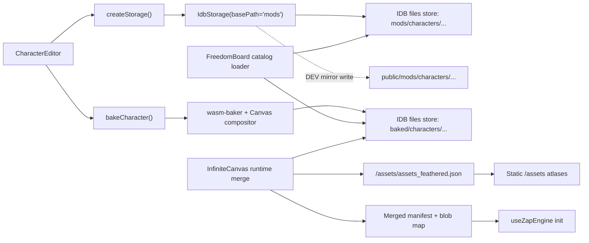
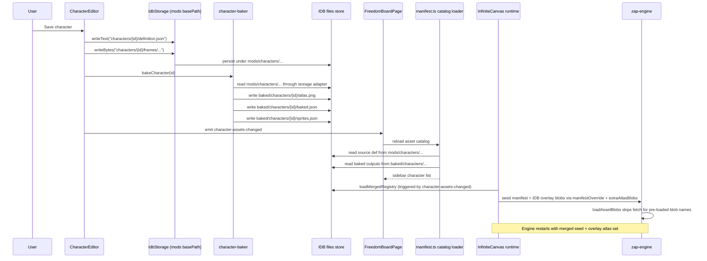
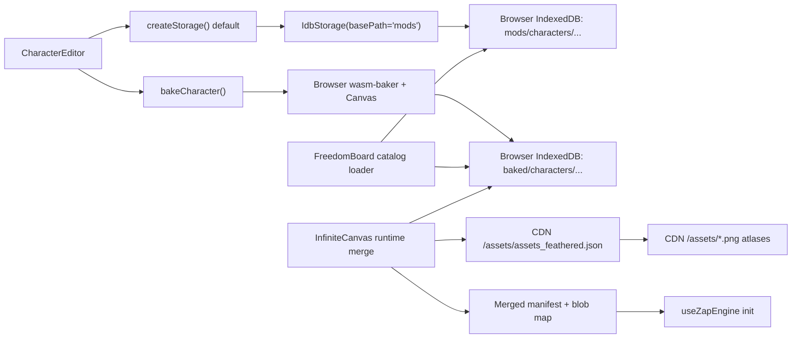

# Freedom Board Asset Lifecycle

## Scope
This document maps how character-related assets move from the editors into Freedom Board, where each artifact lives, and how the runtime merge boundary works.

The important distinction is:
- **Source assets**: authored by editors, logically addressed as `characters/...`
- **Seed runtime assets**: static bundle under `/assets/...`
- **Derived baked cache**: generated from source, stored under `baked/...`
- **World saves**: sparse board state, stored separately from asset definitions

The system uses a **layered** runtime model:
- **Seed base layer**: static assets from disk/S3/CDN
- **IDB overlay layer**: baked character atlases from IndexedDB
- **Merged view**: one manifest + blob map consumed by zap-engine

Both the sidebar catalog and the runtime renderer use the IDB overlay.

## Canonical Artifact Types

| Artifact | Purpose | Logical path used by code | Physical storage location today |
|---|---|---|---|
| Character source definition | Authoritative identity, equipment, animation declarations | `characters/{id}/definition.json` | `files` store key `mods/characters/{id}/definition.json` when using default `IdbStorage` |
| Character source frame | Authoritative frame pixels | `characters/{id}/frames/{animation}/{direction}/{frame}.png` | `files` store key `mods/characters/{id}/frames/...` when using default `IdbStorage` |
| Baked atlas | Derived runtime texture | `baked/characters/{id}/atlas.png` | `files` store key `baked/characters/{id}/atlas.png` |
| Baked definition | Derived runtime metadata | `baked/characters/{id}/baked.json` | `files` store key `baked/characters/{id}/baked.json` |
| Baked sprite registry | Derived sprite index entries | `baked/characters/{id}/sprites.json` | `files` store key `baked/characters/{id}/sprites.json` |
| Seed board metadata | Tile/character/object catalog for the app | `/assets/manifest.json` | Static files served by app/CDN |
| Seed runtime registry | zap-engine runtime atlas/sprite registry | `/assets/assets_feathered.json` | Static files served by app/CDN |
| Freedom Board autosave | World state placed on the board | `worlds.autosave` | `worlds` object store in IndexedDB |

## Key Rule
`CharacterSourceDef` is the authority for identity and equipment.

The baked outputs are not authority. They are a derived cache required for any runtime that renders from atlases.

## Runtime Merge Architecture

### Engine Loader Contract
`loadAssetBlobs()` in `zap-engine/packages/zap-web/src/assets/loader.ts` accepts an optional `preloadedBlobs?: Map<string, Blob>`. Atlas names already present in that map are used as-is — no network fetch is issued. This supports the layered model: seed atlases from disk/S3, overlay atlases from IDB blobs.

### Merge Flow
`loadMergedRegistry()` in `ui/web/src/lib/asset-registry-merge.ts`:
1. Fetches seed manifest from `assets_feathered.json`
2. Scans IDB for baked character outputs
3. For each baked character: appends atlas descriptor to manifest, merges sprite entries with corrected atlas index, loads atlas PNG blob from IDB
4. Returns `{ manifest, extraAtlasBlobs, bakedCharacterIds }`

### InfiniteCanvas Integration
- On mount: calls `refreshMergedRegistry()` which runs `loadMergedRegistry()`
- On `character-assets-changed` event: calls `refreshMergedRegistry()` again
- Generation counter discards stale async results from overlapping refreshes
- When baked characters exist: sets `manifestOverride` + `extraAtlasBlobs` on `useZapEngine`, which triggers engine restart with the merged view
- When no baked characters exist: state stays undefined, engine boots from `assetsUrl` directly (seed-only, no restart)

### Live Refresh
```
CharacterEditor save → bake → emitCharacterAssetsChanged()
    ↓                                    ↓
FreedomBoardPage                    InfiniteCanvas
    ↓                                    ↓
reloadAssetCatalog()           refreshMergedRegistry()
    ↓                                    ↓
sidebar updated              engine restarts with new overlay
```

## Local Development Lifecycle

### Storage Topology


### Sequence


### Local Behavior Notes
- The editor does **not** write directly to `/assets/`.
- Default storage writes user-authored source assets into IndexedDB and mirrors them to `public/mods/...` only as a development convenience.
- The baker writes derived outputs directly into IndexedDB `files`, not through `mods/`.
- Freedom Board sidebar discovers user characters by reading source definitions and baked outputs from IndexedDB.
- The runtime loads the merged manifest (seed + IDB overlay) on mount and on each `character-assets-changed` event.

## Deployment Lifecycle

### Storage Topology


### Deployment Behavior Notes
- With the default storage adapter, deployed editing is still browser-local unless the app is explicitly configured to use `S3Storage`.
- The runtime merge works identically in deployment: seed from CDN, overlay from browser-local IDB.
- A character authored in one browser will not be visible in another browser unless a remote storage/publish path is explicitly introduced.

## Where Things Live

### Browser IndexedDB
- `files` store:
  - `mods/characters/{id}/definition.json`
  - `mods/characters/{id}/frames/...`
  - `baked/characters/{id}/atlas.png`
  - `baked/characters/{id}/baked.json`
  - `baked/characters/{id}/sprites.json`
- `worlds` store:
  - `autosave`
  - named board saves
- `config` store:
  - board debug flags
  - board SAB lock preference

### Static App / CDN
- `/assets/manifest.json`
- `/assets/assets_feathered.json`
- `/assets/*.png` referenced by runtime manifest
- `/mods/...` only in local development if mirrored by `IdbStorage` or written by `LocalStorage`

### Optional S3 Path
Only relevant if `createStorage()` is explicitly configured to use `S3Storage`.

Then source assets would live under:
- `s3://{bucket}/{basePath}/characters/...`

This is not the default code path currently used by Freedom Board editing.

## Known Technical Debt

1. **No character delete event**: character deletion does not emit `character-assets-changed`. A deleted baked character remains in the runtime overlay until page reload. Fix: emit an event from the delete flow, or add a dedicated `character-deleted` event.

2. **No baked cache purge on source deletion**: deleting a source definition does not automatically remove its baked outputs from IDB. Stale baked artifacts may persist and appear in the overlay. Fix: delete baked outputs when source is deleted, or add a stale-cache sweep.

3. **Normal map parity**: `loadNormalMapBlobs()` does not yet accept pre-loaded blobs. If overlay atlases ever carry normal maps, the same layered loading pattern must be applied to that function.

4. **Engine restart granularity**: re-baking an existing character triggers a full engine teardown + restart. Hot-patching a single atlas texture without full restart is not implemented. Acceptable for current scale but may need optimization for large atlas sets.

5. **Duplicate seed manifest fetch**: when baked characters exist, the seed manifest is fetched twice — once by `loadMergedRegistry()` and once by `useZapEngine`'s initial start (which is then superseded by the restart with the merged manifest). The first engine start is effectively discarded. Optimization: could be avoided by deferring engine start until merge completes, but the current approach avoids the P1 dead-state bug that gating introduced.
